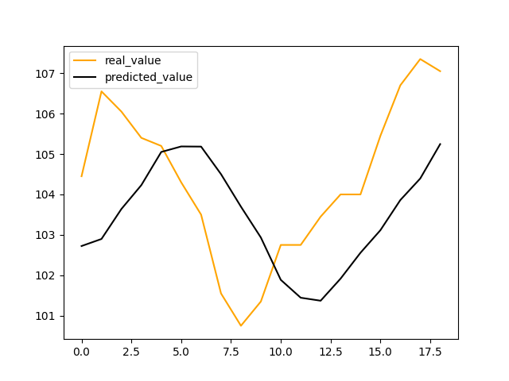

## 資料集
使用TA提供Training data（1224筆）& Testing data（20筆），測試集時間順序在訓練集之後，資料欄位依序分別為「開盤價」、「當日最高價」、「當日最低價」、「收盤價」，再增加「中間值」(當日最高價與當日最低價的平均)的資料欄位

## 交易動作
* 目前不持股(0)：
    * 若明日股價高於今日，則action=1
    * 若明日股價低於今日，則action=-1

* 目前持有1股(1)：
    * 若明日股價高於今日，則action=0
    * 若明日股價低於今日，則action=-1
    
* 目前做空1股(-1)：
    * 若明日股價高於今日，則action=0
    * 若明日股價低於今日，則action=1
    

## 使用模型 LSTM
#### 模型說明
因為股價擁有時序的特性，也就是昨天的股票和走勢對於今日的股價或多或少是會有影響的，甚至有很多技術派的交易者會透過5日均線、20日均線策略來進行交易的進出準則。過去也有很多利用回歸、SVM等方式進行股價預測的作法，但由於近年來Deep learning的發展，許多可以處理序列型資料的方法也越來越多，而今天使用的LSTM(長短期記憶模型)，便是一種RNN-base的演算法改良版，使用RNN-based的演算法可以將時間的屬性考慮進去，意即昨天的股價對於今天的股價會有影響這個想法是在RNN中得以實現的，而LSTM又改良了一些RNN的缺點，因此便是我選用LSTM的理由

## 訓練成效


## cmd執行程式
```
python app.py --training training_data.csv --testing testing_data.csv --output output.csv
```
